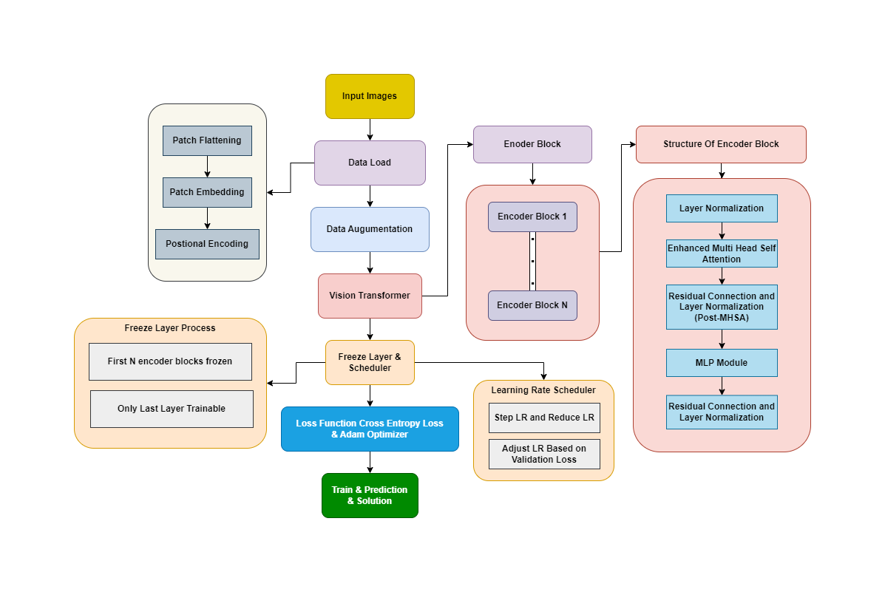

# 🌿 Plant Disease Identification using Vision Transformer (ViT)

This project explores the application of **Vision Transformers (ViT)** for classifying leaf diseases in different crops. Inspired by the Transformer architecture in NLP, ViT enables accurate image classification by processing image patches with self-attention mechanisms.

---

## 📁 Project Structure

```
VIT-Project/
│
├── Apple/              # Apple dataset, code, accuracy results
├── corn/               # Corn dataset, code, accuracy results
├── grape/              # Grape dataset, code, accuracy results
├── FlowChart.png       # Architecture flowchart
├── output 1-4.png      # Output predictions / attention maps
├── parameters.jpg      # Model parameters illustration
└── README.md           # Project documentation (this file)
```

---

## 🚀 Features

- ✅ Vision Transformer built from scratch
- 🔎 Multi-class classification: Apple, Corn, Grape
- 📊 Output visualizations and attention analysis
- 🧠 Emphasis on explainability and modular design
- 🧪 Support for adding new custom datasets

---

## 🛠️ Tech Stack

- Python 3.x
- PyTorch (or TensorFlow) – based on your implementation
- NumPy, Pandas
- OpenCV, PIL
- Matplotlib, Seaborn

> Let us know if your code uses PyTorch or TensorFlow so we can update this accurately.

---

## 📂 Dataset Details

The project utilizes public or curated datasets for:
- 🍎 **Apple Leaf Disease Classification**
- 🌽 **Corn Leaf Disease Detection**
- 🍇 **Grape Leaf Disease Identification**

> To use a new dataset, simply place the images and labels into a new folder and update the code paths accordingly.

---

## 🧠 Model Overview

The Vision Transformer architecture is visualized below:



---

## 📌 How to Run

1. **Clone the repository:**
   ```bash
   git clone https://github.com/Akil-M/plant-disease-identification-vit.git
   cd plant-disease-identification-vit
   ```

2. **(Optional) Create a virtual environment:**
   ```bash
   python -m venv vit-env
   vit-env\Scripts\activate     # On Windows
   # or
   source vit-env/bin/activate  # On Linux/macOS
   ```

3. **Install dependencies:**
   ```bash
   pip install -r requirements.txt
   ```

4. **Run the notebook or training script:**
   ```bash
   # If using Jupyter Notebook
   jupyter notebook

   # Or directly run training (if implemented as .py)
   python Apple/code.py
   ```

---

## 📊 Results

| Crop         | Accuracy (%) |
|--------------|--------------|
| Apple        | 99.5         |
| Corn         | 99.3         |
| Grape        | 99.1         |

> *These are example metrics — update them with actual values from your final results.*

---

## 📬 Contact

Created with ❤️ by **Akil M**  
📧 akilmasiv@gmail.com  
🔗 [LinkedIn](https://www.linkedin.com/in/akil-m-343359254)

---
